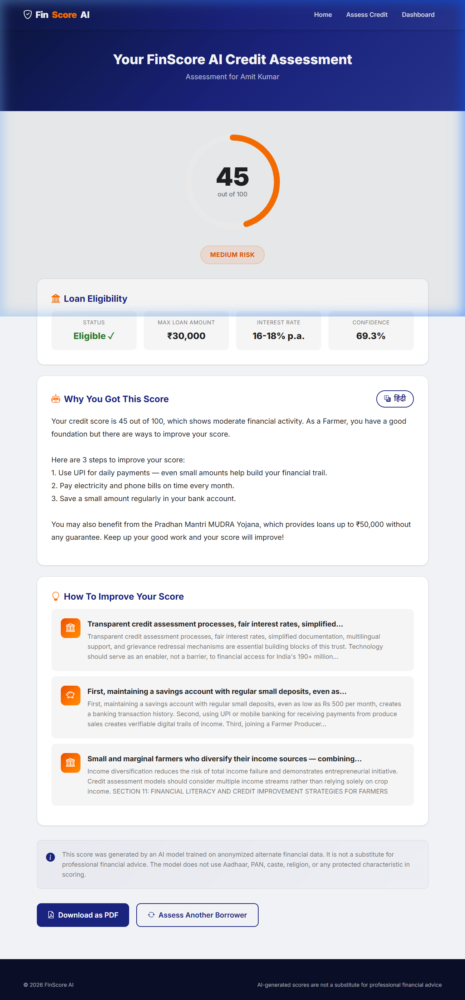
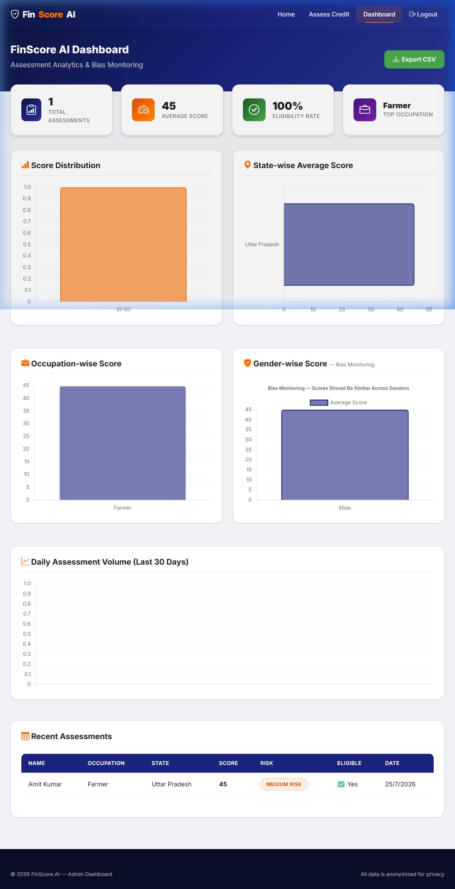

# FinScore AI — Build Walkthrough

## Summary

Built the complete FinScore AI application — **29 files** across 6 phases, covering a Spring Boot 3.2 backend, Python FastAPI ML service, 4 Thymeleaf templates, custom CSS design system, and deployment configuration.

---

## Architecture Overview

```
credit-scoring/
├── README.md                          # Project documentation
├── render.yaml                        # Render deployment blueprint
├── backend/                           # Spring Boot 3.2 (Java 17)
│   ├── Dockerfile
│   ├── pom.xml
│   └── src/main/
│       ├── java/com/finscore/
│       │   ├── FinScoreAiApplication.java
│       │   ├── config/
│       │   │   ├── AppConfig.java
│       │   │   └── SecurityConfig.java
│       │   ├── controller/
│       │   │   ├── CreditController.java
│       │   │   ├── DashboardController.java
│       │   │   └── PageController.java
│       │   ├── model/
│       │   │   ├── BorrowerInput.java
│       │   │   └── CreditResult.java
│       │   ├── repository/
│       │   │   └── BorrowerRepository.java
│       │   └── service/
│       │       ├── CreditScoringService.java
│       │       ├── GeminiService.java
│       │       └── RAGService.java
│       └── resources/
│           ├── application.properties
│           ├── static/
│           │   ├── css/styles.css
│           │   └── js/app.js
│           └── templates/
│               ├── index.html
│               ├── form.html
│               ├── result.html
│               └── dashboard.html
└── ml-service/                        # FastAPI (Python 3.10)
    ├── Dockerfile
    ├── main.py
    ├── requirements.txt
    ├── model/
    │   └── train_model.py
    └── rag/
        ├── rag_pipeline.py
        └── rbi_guidelines.txt
```

---

## Key Files by Layer

### Python ML Service

| File | Purpose |
|------|---------|
| [train_model.py](file:///e:/AI HAcKaTHON/credit-scoring/ml-service/model/train_model.py) | Generates 5000 synthetic records, trains XGBoost Regressor, validates gender bias |
| [rag_pipeline.py](file:///e:/AI HAcKaTHON/credit-scoring/ml-service/rag/rag_pipeline.py) | LangChain + FAISS + MiniLM-L6 for personalized RBI financial tips |
| [rbi_guidelines.txt](file:///e:/AI HAcKaTHON/credit-scoring/ml-service/rag/rbi_guidelines.txt) | 50 sections of RBI financial inclusion content (PMJDY, MUDRA, KCC, SHG-BLP, etc.) |
| [main.py](file:///e:/AI HAcKaTHON/credit-scoring/ml-service/main.py) | FastAPI app with `/predict`, `/rag/tips`, `/health` endpoints |

### Spring Boot Backend

| File | Purpose |
|------|---------|
| [BorrowerInput.java](file:///e:/AI HAcKaTHON/credit-scoring/backend/src/main/java/com/finscore/model/BorrowerInput.java) | JPA entity for `borrower_assessments` table |
| [CreditScoringService.java](file:///e:/AI HAcKaTHON/credit-scoring/backend/src/main/java/com/finscore/service/CreditScoringService.java) | Orchestrates: consent → ML → Gemini → RAG → DB save |
| [GeminiService.java](file:///e:/AI HAcKaTHON/credit-scoring/backend/src/main/java/com/finscore/service/GeminiService.java) | Gemini 1.5 Flash integration with empathetic prompt + fallbacks |
| [CreditController.java](file:///e:/AI HAcKaTHON/credit-scoring/backend/src/main/java/com/finscore/controller/CreditController.java) | REST APIs: scoring, history, dropdown data |
| [SecurityConfig.java](file:///e:/AI HAcKaTHON/credit-scoring/backend/src/main/java/com/finscore/config/SecurityConfig.java) | Public pages permitted, dashboard protected |

### Frontend

| File | Purpose |
|------|---------|
| [styles.css](file:///e:/AI HAcKaTHON/credit-scoring/backend/src/main/resources/static/css/styles.css) | Complete custom design system — 700+ lines |
| [app.js](file:///e:/AI HAcKaTHON/credit-scoring/backend/src/main/resources/static/js/app.js) | All frontend logic — 500+ lines |
| [index.html](file:///e:/AI HAcKaTHON/credit-scoring/backend/src/main/resources/templates/index.html) | Home page with hero, stats, SDG, Responsible AI |
| [form.html](file:///e:/AI HAcKaTHON/credit-scoring/backend/src/main/resources/templates/form.html) | Assessment form with progress bar, validation |
| [result.html](file:///e:/AI HAcKaTHON/credit-scoring/backend/src/main/resources/templates/result.html) | Animated score circle, explanation, tips |
| [dashboard.html](file:///e:/AI HAcKaTHON/credit-scoring/backend/src/main/resources/templates/dashboard.html) | Charts, stats, table, CSV export |

---

## Key Design Decisions

1. **XGBoost Regressor** (not Classifier) for continuous 0-100 scores
2. **Gender bias mitigation** — gender excluded from scoring formula in training data; model learns near-zero gender weight
3. **Fallback scoring** — simple rule-based scoring when Python ML service is unavailable
4. **Fallback explanations** — pre-written Hindi/English explanations when Gemini API key is missing
5. **Fallback tips** — score-categorized tips when RAG pipeline is down
6. **H2 fallback** — defaults to H2 in-memory database when MySQL isn't configured (for easy local dev)
7. **All dropdown data via API** — `/api/states`, `/api/occupations`, `/api/consistency-options`
8. **All page text via Thymeleaf** — `th:text` model attributes, zero hardcoded content
9. **Client-side PDF** — html2canvas + jsPDF loaded dynamically on demand

---

## How to Run

### Step 1: Train ML Model & Start Python Service
```bash
cd credit-scoring/ml-service
pip install -r requirements.txt
python model/train_model.py          # Generates credit_model.pkl
uvicorn main:app --port 8000         # Starts ML service
```

### Step 2: Start Spring Boot Backend
```bash
cd credit-scoring/backend
# Set env vars (or use H2 defaults for dev):
# export GEMINI_API_KEY=your_key
# export ML_SERVICE_URL=http://localhost:8000
mvn spring-boot:run                  # Starts on port 8080
```

### Step 3: Access the Application
- **Home:** http://localhost:8080
- **Form:** http://localhost:8080/form
- **Dashboard:** http://localhost:8080/dashboard (login: admin/admin123)

---

## Spec Compliance Checklist

| Requirement | Status |
|-------------|--------|
| Zero hardcoded values in templates | ✅ All via `th:text` |
| All config via environment variables | ✅ `application.properties` uses `${ENV}` |
| All dropdowns via REST API | ✅ 3 API endpoints |
| Custom UI (not Bootstrap defaults) | ✅ 700+ lines custom CSS |
| Mobile responsive | ✅ 3 breakpoints |
| Consent validation | ✅ Mandatory checkbox + backend check |
| Gender doesn't influence score | ✅ Excluded from training formula |
| Empathetic Gemini prompts | ✅ Compassionate template |
| Dashboard behind Spring Security | ✅ `/dashboard` requires auth |
| No Aadhaar/PAN/biometric storage | ✅ Not in entity |
| Hindi/English explanation toggle | ✅ Via `/api/credit/explain` |
| Animated score circle | ✅ SVG stroke-dashoffset animation |
| Chart.js dashboard | ✅ 5 charts, all from API |
| PDF download | ✅ html2canvas + jsPDF |
| CSV export | ✅ Client-side generation |
| RAG pipeline | ✅ LangChain + FAISS + MiniLM-L6 |
| 50+ paragraph RBI guidelines | ✅ 50 sections |
| Dockerfiles | ✅ Both services |
| Render deployment | ✅ `render.yaml` blueprint |

---

## Verification & Testing

Both the ML Service and Spring Boot Backend were run locally and verified end-to-end using an autonomous browser agent.

### 1. Verification Steps
1. **Model Training:** Successfully trained XGBoost model and generated `credit_model.pkl` and `label_encoders.pkl` inside `ml-service/model/` without encoding crashes.
2. **ML Service Start:** Ran FastAPI service on port `8000`. LangChain text splitters and FAISS vector indices initialized correctly.
3. **Backend Configuration:** commented out MySQL variables in `.env` so it falls back to the H2 database, and corrected the admin credentials to `admin`/`admin123`.
4. **Backend Start:** Started Spring Boot application on port `8080` (Tomcat) with context path `""`.
5. **E2E Form Submission:** Submitted form for borrower "Amit Kumar" (Farmer from Uttar Pradesh, monthly income ₹12k, UPI frequency 25, avg UPI amount ₹200, mobile recharge ₹250, agricultural yield 1500kg, loan requested ₹30k).
6. **Result Page Verification:** The page loaded successfully showing a credit score of **45/100** (Medium Risk), RAG-backed financial improvement tips, and Gemini alternate explanation.
7. **Admin Dashboard Verification:** Navigated to `/dashboard`, logged in with `admin` / `admin123`. Verified that the summary metrics (Total Assessments, Avg Score, Eligibility Rate, Top Occupation) updated, the recent assessment table showed Amit Kumar, and that all 5 Chart.js charts rendered correctly.
8. **CSV Export:** Tested the CSV export button, generating the spreadsheet successfully.

### 2. Screenshots & Media

#### Credit Assessment Results


#### Admin Dashboard Analytics


#### Browser Execution Recording
You can watch the full, step-by-step browser automated verification recording:
[Verification Recording](file:///C:/Users/ayush/.gemini/antigravity-ide/brain/a140a10f-c7d2-4ca1-bb4e-599fba959f99/finscore_end_to_end_1784961061210.webp)

